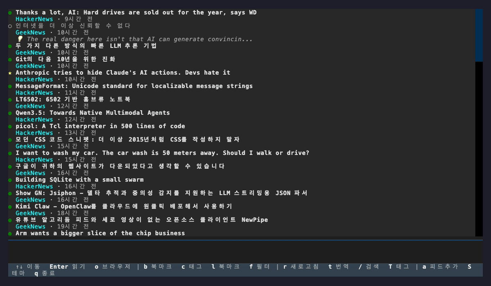

# Hawaii Disco

> Your AI-powered reading companion in the terminal


[](https://github.com/ongyjho/hawaiidisco/actions/workflows/ci.yml)
[](https://pypi.org/project/hawaiidisco/)



Hawaii Disco is a terminal RSS reader that doesn't just show you articles — it reads alongside you. With built-in AI, it generates sharp insights, translates foreign articles, and analyzes your bookmark patterns, turning passive reading into active discovery.

---

## Why Hawaii Disco?

Most RSS readers stop at delivering headlines. Hawaii Disco goes further:

- **Read an article** and instantly get an AI-generated insight on why it matters
- **Hit `t`** and the full article is translated into your language
- **Bookmark a few articles** and AI finds the common threads across your interests
- **Sync to Obsidian** — bookmarked articles auto-save as Obsidian notes with frontmatter and tags
- **Import/export OPML** — migrate feeds from any RSS reader
- **All in your terminal** — no browser tabs, no distractions, just you and the content

It works great as a plain RSS reader too. AI features are optional and activate only when you ask.

---

## Features

- **Terminal-native** — Built on [Textual](https://github.com/Textualize/textual), vim-style keybindings
- **AI Insights** — One-keystroke article analysis: why it matters, what to watch out for
- **Translation** — Translate titles, descriptions, and full article bodies
- **Bookmark & Memo** — Save articles with personal notes, exported as Markdown
- **Bookmark Analysis** — AI finds patterns and themes across your saved articles
- **Obsidian Integration** — Auto-save bookmarks as Obsidian notes with YAML frontmatter and tags
- **OPML Import/Export** — Migrate feeds to and from other RSS readers
- **Multiple AI Providers** — Claude CLI, Anthropic API, OpenAI API (or none at all)
- **6 Languages** — English, Korean, Japanese, Chinese (Simplified), Spanish, German

---

## Installation

### pipx (Recommended)

[pipx](https://pipx.pypa.io/) installs CLI tools in isolated environments — no virtualenv setup needed:

```bash
pipx install hawaiidisco
```

To enable AI features with a specific provider:

```bash
pipx install "hawaiidisco[anthropic]"   # Claude API
pipx install "hawaiidisco[openai]"      # OpenAI API
pipx install "hawaiidisco[all]"         # All providers
```

### pip

```bash
pip install hawaiidisco

# With AI provider extras
pip install hawaiidisco[anthropic]
pip install hawaiidisco[openai]
pip install hawaiidisco[all]
```

### From Source

```bash
git clone https://github.com/ongyjho/hawaiidisco.git
cd hawaiidisco
python -m venv .venv
source .venv/bin/activate
pip install -e ".[all]"
```

---

## Quick Start

```bash
hawaiidisco
```

On first launch, a default config is created at `~/.config/hawaiidisco/config.yml` with sample feeds.

---

## Configuration

Edit `~/.config/hawaiidisco/config.yml`:

```yaml
# Language: en | ko | ja | zh_CN | es | de
language: en

# AI provider configuration
ai:
  provider: claude_cli   # claude_cli | anthropic | openai
  api_key: ""            # Leave empty to use environment variable
  model: ""              # Leave empty for provider default

# RSS feed list
feeds:
  - url: https://hnrss.org/frontpage
    name: HackerNews
  - url: https://feeds.feedburner.com/geeknews-feed
    name: GeekNews

# Refresh interval in minutes
refresh_interval: 30

# AI insight settings
insight:
  enabled: true
  mode: manual           # auto | manual

# Bookmark export path
bookmark_dir: ~/.local/share/hawaiidisco/bookmarks

# Obsidian vault integration
obsidian:
  enabled: false
  vault_path: ~/Documents/MyVault
  folder: hawaii-disco     # Subfolder inside the vault
  template: default        # default | minimal
  auto_save: true          # Auto-save on bookmark
  include_insight: true
  include_translation: true
```

### AI Providers

Hawaii Disco works without AI — but it shines with it. Pick any provider:

| Provider | Install | Config | Note |
|----------|---------|--------|------|
| Claude CLI | Install [Claude Code](https://claude.ai/code) | `provider: claude_cli` | Default, no API key needed |
| Anthropic API | `pip install hawaiidisco[anthropic]` | `provider: anthropic` | API key required |
| OpenAI API | `pip install hawaiidisco[openai]` | `provider: openai` | API key required |

Setting API keys:

```bash
# Environment variables
export ANTHROPIC_API_KEY=sk-ant-...
export OPENAI_API_KEY=sk-...
```

```yaml
# Or reference env vars in config.yml
ai:
  provider: anthropic
  api_key: ${ANTHROPIC_API_KEY}
```

### OPML Import/Export

Migrate your feeds from any RSS reader:

```
Shift+I   Import feeds from an OPML file
Shift+E   Export current feeds to OPML
```

---

## Keyboard Shortcuts

### Timeline

| Key | Action |
|-----|--------|
| `j` `k` / `↑` `↓` | Navigate articles |
| `Enter` / `Space` | Read article |
| `o` | Open in browser |
| `i` | Generate AI insight |
| `t` | Translate title & description |
| `b` | Toggle bookmark |
| `m` | Add memo to bookmark |
| `r` | Refresh feeds |
| `/` | Search |
| `f` | Filter bookmarks only |
| `a` | Add feed |
| `l` | Bookmark list |
| `L` | Feed list |
| `S` | Save to Obsidian |
| `I` | Import OPML |
| `E` | Export OPML |
| `q` | Quit |

### Article Viewer

| Key | Action |
|-----|--------|
| `j` `k` / `↑` `↓` | Scroll |
| `PgUp` `PgDn` | Page scroll |
| `g` / `G` | Top / Bottom |
| `t` | Translate body |
| `i` | Generate insight |
| `o` | Open in browser |
| `q` / `Escape` | Close |

---

## Architecture

```
hawaiidisco/
├── app.py              # Textual main app & screens
├── ai/                 # AI providers (Protocol-based abstraction)
│   ├── base.py         # AIProvider Protocol definition
│   ├── claude_cli.py   # Claude CLI implementation
│   ├── anthropic_api.py# Anthropic API implementation
│   ├── openai_api.py   # OpenAI API implementation
│   └── prompts.py      # Prompt templates
├── widgets/            # UI components
│   ├── timeline.py     # Article timeline
│   ├── detail.py       # Article detail view
│   └── status.py       # Status bar
├── i18n/               # YAML-based locale system
│   ├── locales/        # en, ko, ja, zh_CN, es, de
│   └── validate.py     # Locale file validator
├── config.py           # YAML config loader
├── db.py               # SQLite database (thread-safe)
├── fetcher.py          # RSS feed parser
├── md_render.py        # Markdown rendering utilities
├── insight.py          # AI insight generation
├── reader.py           # HTML to text extraction
├── translate.py        # AI translation
├── bookmark.py         # Bookmark Markdown export
├── obsidian.py         # Obsidian vault integration
└── opml.py             # OPML import/export
```

### Adding a Custom AI Provider

Implement the `AIProvider` Protocol:

```python
from hawaiidisco.ai.base import AIProvider

class MyProvider:
    def generate(self, prompt: str, *, timeout: int = 30) -> str | None:
        ...

    def is_available(self) -> bool:
        ...

    @property
    def name(self) -> str:
        return "my_provider"
```

---

## Development

### Setup

```bash
git clone https://github.com/ongyjho/hawaiidisco.git
cd hawaiidisco
python -m venv .venv
source .venv/bin/activate
pip install -e ".[dev,all]"
```

### Test

```bash
pytest -v
```

### Lint

```bash
ruff check hawaiidisco/ tests/
```

### CI

Tests run automatically on Python 3.11 / 3.12 / 3.13 via GitHub Actions.
Releases are managed by [release-please](https://github.com/googleapis/release-please) and published to PyPI automatically.

---

## Contributing

Contributions are welcome! Please follow these steps:

1. Fork this repository
2. Create a feature branch (`git checkout -b feature/my-feature`)
3. Commit your changes (`git commit -m "feat: description"`)
4. Push to the branch (`git push origin feature/my-feature`)
5. Open a Pull Request

### Adding a New Language

See [`hawaiidisco/i18n/CONTRIBUTING.md`](hawaiidisco/i18n/CONTRIBUTING.md) for the locale contribution guide.

### Guidelines

- **Branch naming**: Use `feature/`, `bugfix/`, `hotfix/` prefixes
- **Commit messages**: `type: description` format (feat, fix, chore, refactor, docs)
- **Code style**: Must pass `ruff` linting
- **Tests**: Include tests for new features
- **Python**: Maintain 3.11+ compatibility

### Issues & PRs

- Report bugs or request features via [Issues](https://github.com/ongyjho/hawaiidisco/issues)
- Check for existing issues before opening a PR

---

## Roadmap

- [x] OPML import/export
- [x] Demo screenshot / GIF
- [x] Obsidian vault integration
- [x] 6 languages (EN/KO/JA/ZH-CN/ES/DE)
- [ ] Plugin system
- [ ] Additional AI providers (Gemini, Ollama, etc.)
- [ ] Theme customization

---

## Data Storage

| Item | Path |
|------|------|
| Config | `~/.config/hawaiidisco/config.yml` |
| Database | `~/.local/share/hawaiidisco/hawaiidisco.db` |
| Bookmarks | `~/.local/share/hawaiidisco/bookmarks/` |

---

## License

[MIT](LICENSE)
